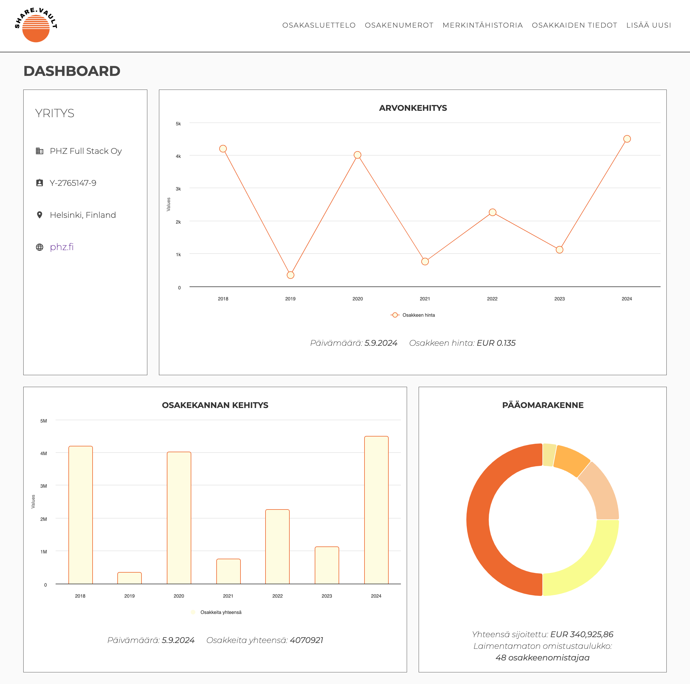
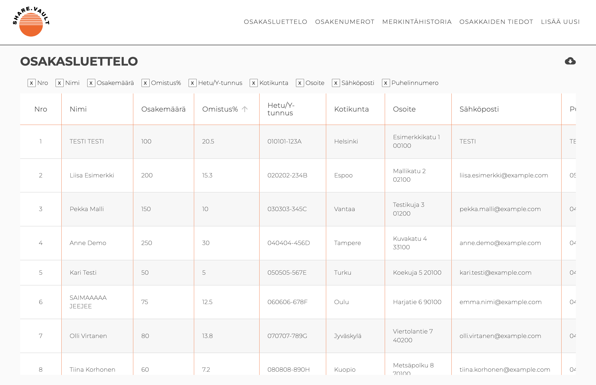

# Tervehdys!

Olen **Saima**, **Full Stack -ohjelmistokehityksen opiskelija** Helsinki Business Collegessa. Olen alanvaihtaja ja tämän johdosta urani koodarina on vielä alkutaipaleella, mutta into oppia, ja kova halu tehdä töitä vievät minua vauhdilla eteenpäin. Keskityn opinnoissani erityisesti web-teknologioihin, kuten **Reactiin** ja **Javaan**, ja hommat sujuvat yhtä lailla suomeksi kuin englanniksikin. 

Kehittyäkseni edelleen, tartun mielelläni haastaviin projekteihin, joista voin oppia mahdollisimman paljon uutta. Jokainen projekti vie minut askeleen lähemmäs ammattilaisuutta, enkä malta odottaa, mitä tulevaisuus tuo tullessaan.

## 🔧 Taitoni

Opintoni ja projektipainotteinen työskentely ovat antaneet minulle erinomaisen pohjan näillä osa-alueilla:

- 🌐 **Front-end**: HTML5, CSS3, JavaScript, React
- 🖥️ **Back-end**: Java, Spring Boot
- 🗄️ **Tietokannat**: SQL, H2 Database, tietokantarakenteet
- 🔄 **Versionhallinta**: Git & GitHub
- 🎨 **UI/UX-suunnittelu**: Figma, prototyyppaus
- 🤸‍♀️ **Muut taidot**: REST API:t, responsiivinen suunnittelu, testaus, ketterät menetelmät (scrum)

Olen saanut rutkasti käytännön kokemusta erilaisten kouluprojektien kautta, ja into ohjelmointiin kasvaa jokaisen uuden haasteen myötä. Parasta on, kun saan kehittää tehokkaita ratkaisuja monimutkaisiin ongelmiin.

## 📚 Projektit

Tässä muutama esimerkki projekteista, joissa olen päässyt soveltamaan oppimiani taitoja viimeisen 9 kuukauden aikana:

#### ShareVault
Tämä projekti on meneillään oleva kurssityömme, jota toteutamme neljän hengen ryhmässä. Sovellus on suunniteltu osakasrekisterin hallintaan, ja sen avulla yhtiöt voivat helposti ja tehokkaasti hallinnoida osakkeenomistajien tietoja ja osakekauppoja. ShareVault tarjoaa osakasluettelon hallinnan, osakkeiden myyntien ja ostojen seurannan sekä visuaaliset kaaviot osakkeiden arvonkehityksestä. Käyttäjät voivat tarkastella omistusosuuksia, järjestellä tietoja taulukossa ja saada reaaliaikaisia tietoja osakkeenomistajista. Sovellus on rakennettu Reactilla ja Highcharts-kirjastolla visuaalisten esitysten luomiseksi. Backend on toteutettu Spring Boot -teknologialla. Olen itse vastuussa front end toteutuksesta toisen luokkakaverini kanssa, tyyli ja ulkomuoto ovat minun suunnittelemani.

#### [Kahvikauppa](https://github.com/Saima445/kahvikauppa)
Verkkosovellus, joka hallitsee kahvikaupan tuotteita ja tilauksia. Tämä **Spring Boot** -projekti kattaa tuotteenhallinnan, käyttäjähallinnan ja tarjoaa täyden hallintapaneelin. Kaikki toiminnot ja tyylit ovat itse tekemiäni.

#### [SOC Dashboard](https://github.com/IsratJahan13/official_soc_dashboard)
Tietoturvaoperaatioiden hallintaan tarkoitettu SOC Dashboard -sovellus tarjoaa reaaliaikaisen näkymän tietoturvajärjestelmien tapahtumiin. Sovellus on rakennettu **Reactin** ja **Viten** avulla ja siinä on tuettu **dark mode** sekä monimutkaisten tietoturvalokien hallinta. Olin vastuussa käyttöliittymän suunnittelusta, CSS-tyylittelystä, responsiivisesta suunnittelusta sekä työaseman verkkoliikenteen ja eri teemojen toteutuksesta. Moni toiminnallisuus komponenteissa oli myös omaa käsialaani. 

#### [Portfolio](https://saima445.github.io/portfolio-saima/)
Portfoliosivu, joka piti luoda mahdollisimman samanlaiseksi kuin opettajan esimerkkisivu. Rakennettu käyttäen **HTML5** ja **CSS3**.

#### [Countries Information App](https://saima445.github.io/05-react-maiden-tiedot/)
Reactilla toteutettu sovellus, joka hakee tietoja eri maista ja näyttää niiden säätiedot. Käyttää **RESTCountries**- ja **OpenWeatherMap**-API:ta.

#### [Citrus Cafe](https://saima445.github.io/09-citrus-cafe/)
Responsiivinen verkkosivuprojekti, joka on suunniteltu HTML5:n ja CSS3:n avulla. Sovellus keskittyy kauniin ja toimivan käyttöliittymän luomiseen.

## 🚀 Mistä minut löytää

- [LinkedIn](https://www.linkedin.com/in/saima-salonen) — Minuun saa yhteyden tätä kautta minkä tahansa asian tiimoilta.
- [GitHub](https://github.com/Saima445) — Kurkkaa lisää projektejani ja kontribuutioitani.

## ⚡ Haku päällä!

Etsin tällä hetkellä harjoittelupaikkaa viimeistelläkseni koulutukseni. Jos yrityksesi etsii innokasta harjoittelijaa, joka rakastaa koodaamista ja tekee töitä kovalla motivaatiolla, ota rohkeasti yhteyttä LinkedInin kautta!
