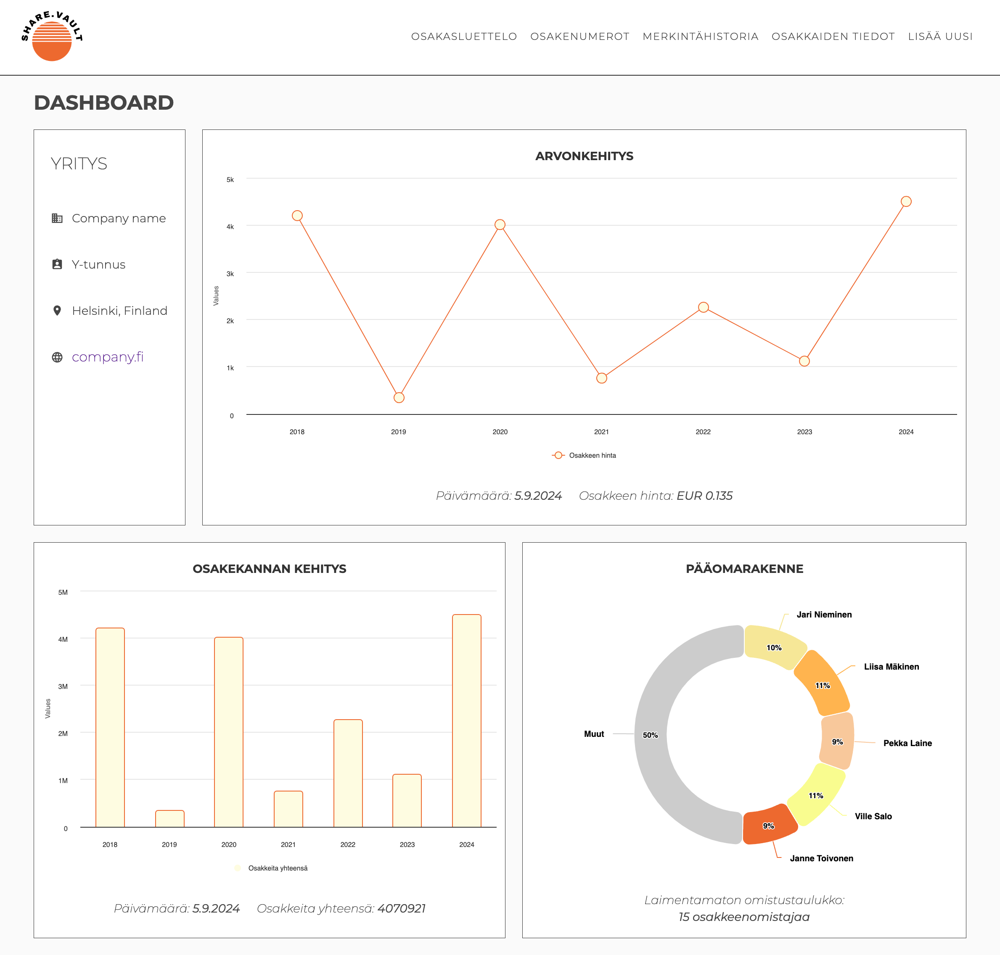
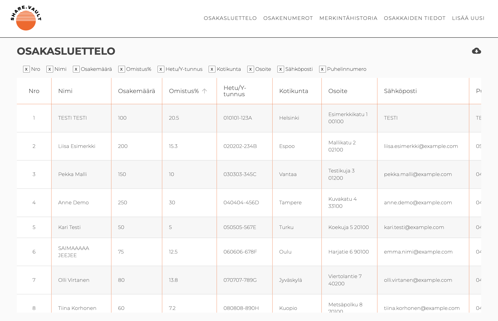
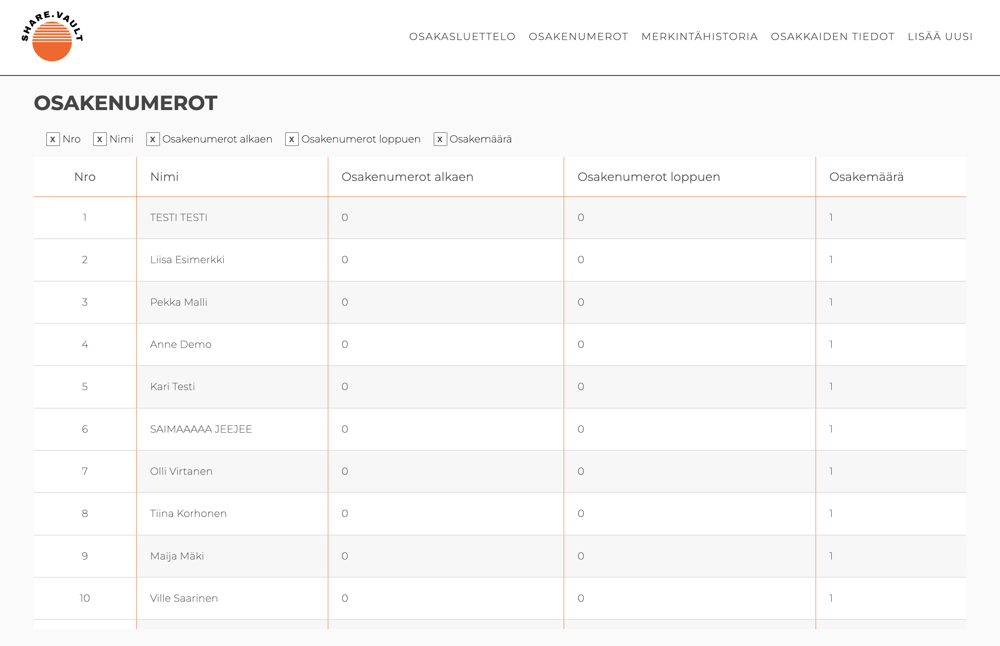
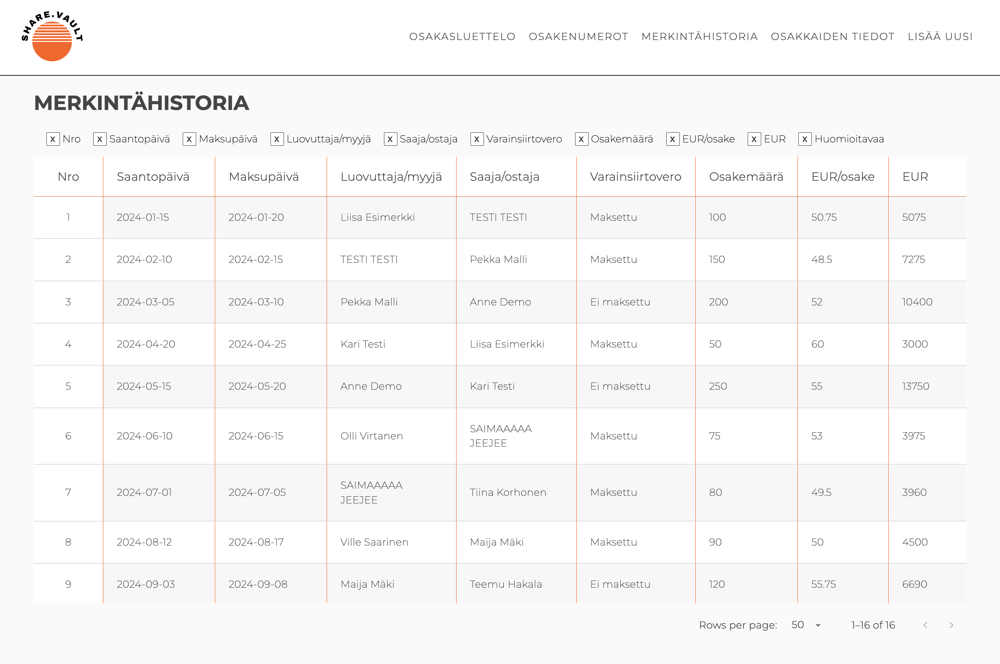
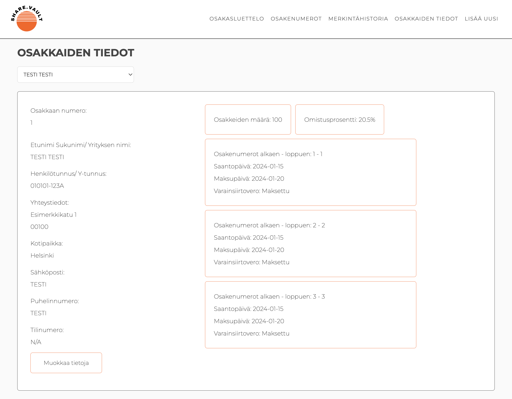
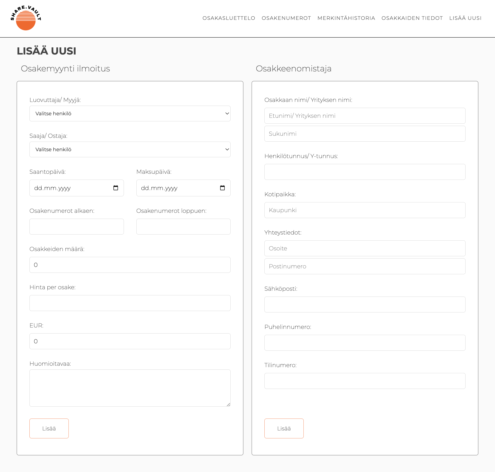

# Greetings!

I’m **Saima**, a **Full Stack software development student** at Helsinki Business College. I’m a career changer, which means my journey as a coder is still at an early stage, but my passion for learning and my strong work ethic drive me swiftly forward. In my studies, I focus on web technologies such as **React** and **Java**, and I’m comfortable working in both Finnish and English.

To further improve, I eagerly take on challenging projects that allow me to learn as much as possible. Each project brings me closer to becoming a professional, and I can’t wait to see what the future holds.

## 🔧 Skills

My studies and project-focused work have built a solid foundation in these areas:

- 🌐 **Front-end**: HTML5, CSS3, JavaScript, React
- 🖥️ **Back-end**: Java, Spring Boot
- 🗄️ **Tietokannat**: SQL, H2 Database, database structures
- 🔄 **Versionhallinta**: Git & GitHub
- 🎨 **UI/UX-suunnittelu**: Figma, prototyping
- 🤸‍♀️ **Muut taidot**: REST APIs, responsive design, testing, agile methods (scrum)

Through various school projects, I’ve gained loads of hands-on experience, and my love for programming grows with each new challenge. I get the most joy when I get to develop efficient solutions to complex problems.

## 📚 Projects

Here are a few examples of projects where I’ve applied my skills over the past 9 months:

#### [ShareVault app](https://github.com/esapuolakka/shareholder.git)

This project is an ongoing group work for our course, which we’re building as a team of four. The app is designed for managing a shareholder registry, making it easy for companies to manage shareholder information and stock transactions. ShareVault includes features like managing a shareholder list, tracking stock sales and purchases, and visual charts for stock value development. Users can view ownership shares, sort data in tables, and get real-time shareholder information. The app is built using React and the Highcharts library for creating visual charts. The backend is developed with Spring Boot. I’m responsible for the front-end development with another classmate, and the design and style are my own creation.

#### [Coffee shop](https://github.com/Saima445/kahvikauppa)

A web app that manages products and orders for a coffee shop. This Spring Boot project covers product management, user management, and offers a complete admin panel. All features and styling are my own work.

#### [SOC Dashboard](https://github.com/IsratJahan13/official_soc_dashboard)

A SOC (Security Operations Center) Dashboard designed for managing security operations, offering a real-time view of security system events. The app is built using React and Vite, with support for dark mode and complex security log management. I was responsible for UI design, CSS styling, responsive design, network traffic analysis, and theme implementation. Many of the functionalities in the components are also my own work.

#### [Portfolio](https://github.com/Saima445/portfolio-saima)

A portfolio page that had to be created to closely match the instructor’s example. Built using HTML5 and CSS3.

#### [Countries information app](https://github.com/Saima445/05-react-maiden-tiedot)

An app built with React that fetches information about different countries and shows their weather. It uses the RESTCountries and OpenWeatherMap APIs.

#### [Citrus Cafe](https://github.com/Saima445/09-citrus-cafe)

A responsive website project designed using HTML5 and CSS3, goal was to closely match the instructor’s example.

## 🚀 Where to Find Me

- [LinkedIn](https://www.linkedin.com/in/saimasalonen/) — Reach out to me here for anything!
- [GitHub](https://github.com/Saima445) — Check out more of my projects and contributions.

## ⚡ I’m Looking for a internship!

I’m currently looking for an internship to complete my studies. If your company is searching for a passionate intern who loves coding and works with great motivation, feel free to contact me via LinkedIn!
