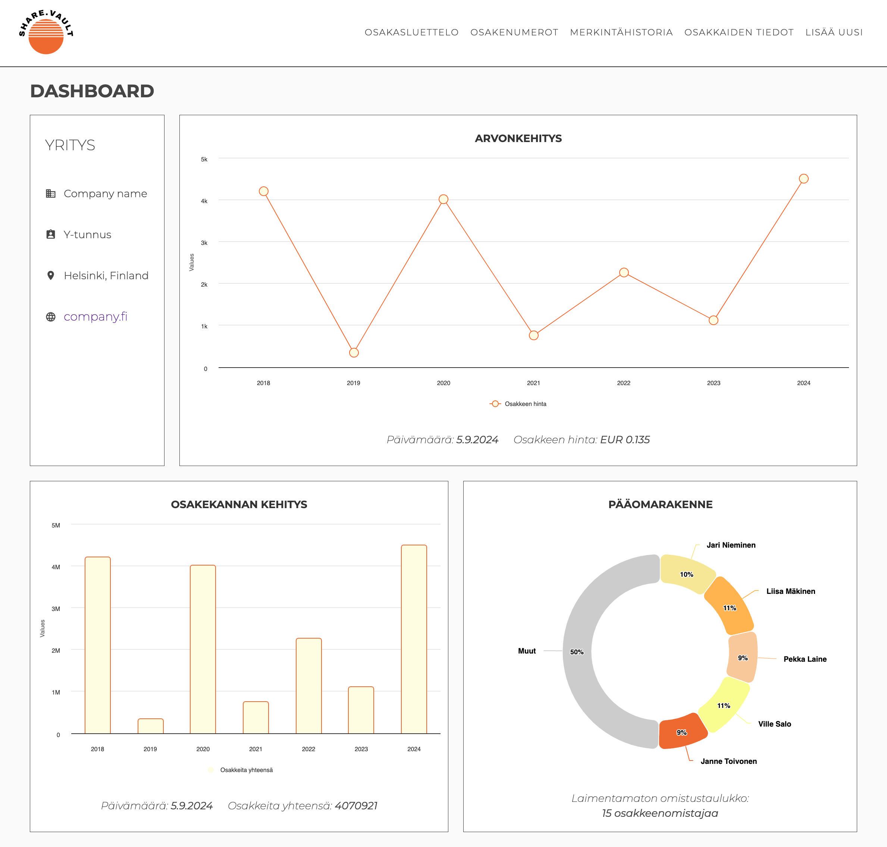
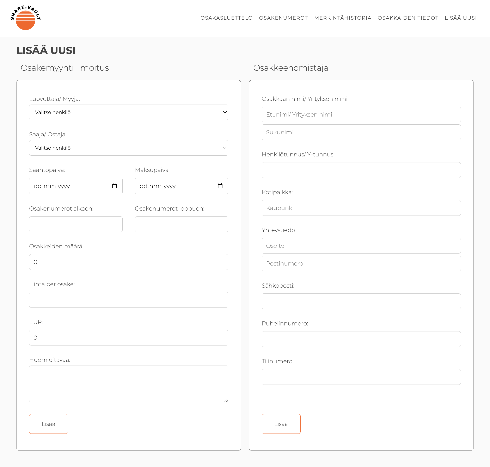
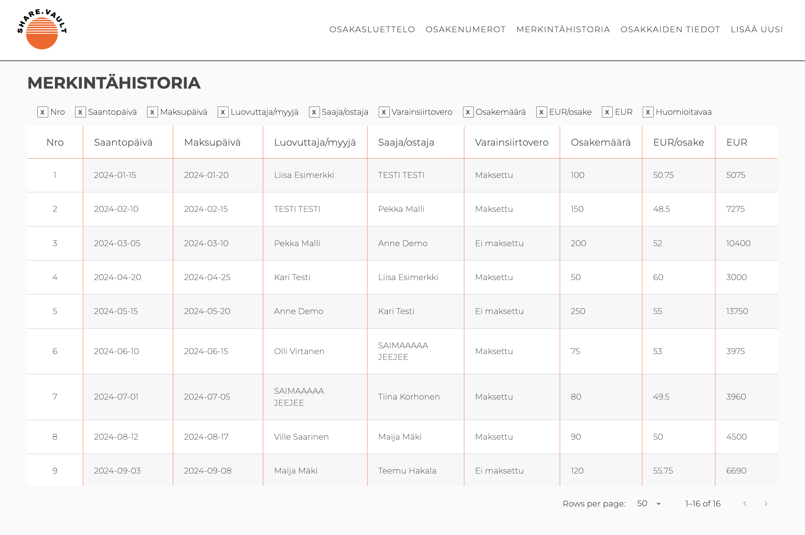
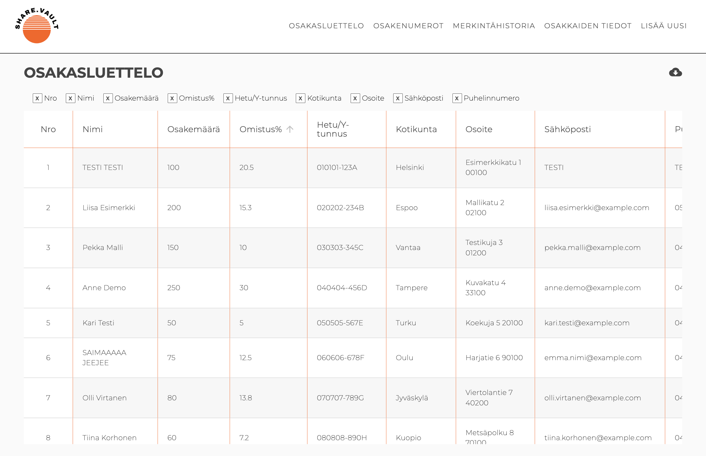
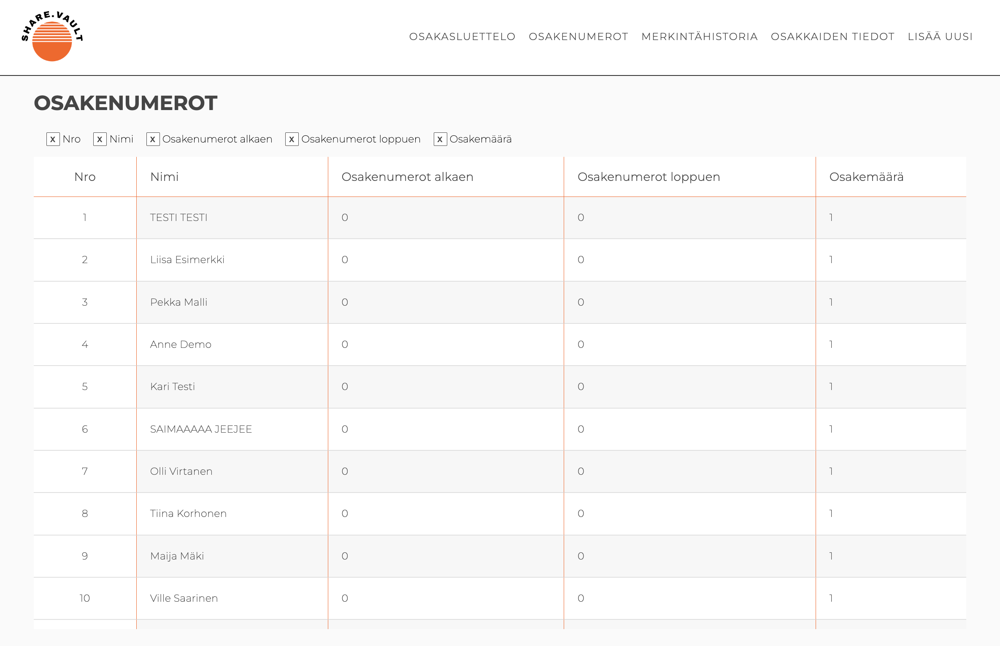
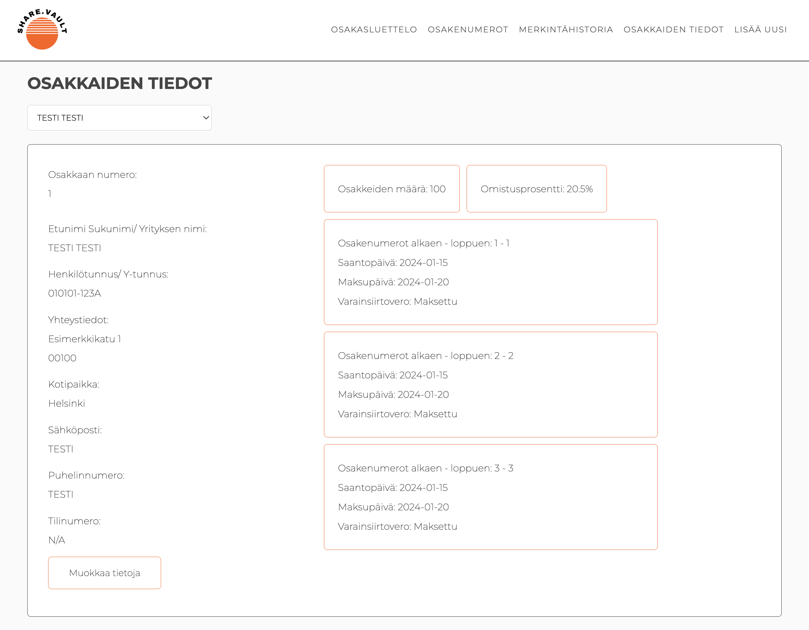

# Greetings!

I’m **Saima**, a junior **Full Stack Developer** based in Helsinki. I recently graduated from Helsinki Business College (2025) with a focus on **React** and **Java**.  

I’m a career changer with a background in hospitality, and coding has gone from curiosity to real passion. I love solving problems, learning fast, and building things that actually work.  

Currently I’m working at a start-up **Octofy** (internship → freelance), where I’ve contributed to building a modern **AI-powered chat platform** from the ground up. My work spans the full stack: from backend logic and database programming to frontend UI and component design. I’ve also learned a great deal about Stripe integrations, prompt engineering, integrating LLMs into platforms, and many other valuable skills.  

Alongside that, I’ve done freelance/school projects like designing and implementing a **WordPress landing page** for a client.  

💡 *Everything can be learned with curiosity and hard work.*  

## 🔧 Tech Stack

- 🌐 **Frontend & Frameworks:** HTML5, CSS3, JavaScript, TypeScript, React, Next.js, Tailwind, Shadcn/UI, Material UI, Magic UI  
- 🖥️ **Backend:** Java, Spring Boot, Node.js, REST APIs  
- 🗄️ **Databases:** PostgreSQL, SQL, H2, database design & structure  
- 🔄 **Version Control & Collaboration:** Git, GitHub, Agile (Scrum)  
- 🎨 **UI/UX Design:** Figma, prototyping, responsive design, user-centered design principles  
- 🤖 **Other Skills:** AI model integration, prompt engineering, software testing basics, teamwork, problem solving

## 🚀 Highlights

- **Junior Full-stack Developer (Octofy Oy, 2024–present)**  
  Building an AI-powered chat platform for all power users.  

- **Website Project (Restaurant Grotesk, 2024)**  
  Designed and implemented a new WordPress site with Elementor and custom code snippets, giving the client a modernized look and feel.  

Through various projects, I’ve gained loads of hands-on experience, and my love for programming grew with each new challenge.

## 📚 Some of my projects

#### [Photo Browser App](https://github.com/Saima445/photo-browser)

This project was created as a pre-assignment for a job application, showcasing my ability to design and build a modern, scalable web application from scratch.

Photo Browser is a Single Page Application built with React, Vite, TypeScript, Tailwind CSS, and shadcn/ui. It fetches and displays photo data from the public JSONPlaceholder API, allowing users to browse albums, view individual photos, and like or save their favorites locally.

The app demonstrates key modern web development principles such as:
-	Scalable architecture with clear separation of routes, layouts, and features
- Dynamic data fetching and caching using TanStack Query, ensuring smooth performance and minimal API calls
- Lazy-loaded routes for faster initial load times
- Infinite scroll and responsive design, making photo browsing seamless across devices
- Reusable UI components styled with shadcn/ui and Tailwind CSS
- Dark mode support, other small detailed features and persistent favorites stored locally

The project highlights both technical implementation and UI/UX thinking, creating a smooth, polished, and realistic SPA experience.
Deployed as a static site via GitHub Pages.  
**Live Demo:** [Photo Browser](https://saima445.github.io/photo-browser/)

#### [ShareVault app](https://github.com/esapuolakka/shareholder.git)

This project is an ongoing group work for our course, which we’re building as a team of four. The app is designed for managing a shareholder registry, making it easy for companies to manage shareholder information and stock transactions. ShareVault includes features like managing a shareholder list, tracking stock sales and purchases, and visual charts for stock value development. Users can view ownership shares, sort data in tables, and get real-time shareholder information. The app is built using React and the Highcharts library for creating visual charts. The backend is developed with Spring Boot. I’m responsible for the front-end development with another classmate, and the design and style are mostly my own creation. Our customer wanted a very simple and easy-to-navigate platform, and that is what we delivered.

  
  
  
  
  
  

#### [Coffee shop](https://github.com/Saima445/kahvikauppa)

A web app that manages products and orders for a coffee shop. This Spring Boot project covers product management, user management, and offers a complete admin panel. All features and styling are my own work.

#### [SOC Dashboard](https://github.com/IsratJahan13/official_soc_dashboard)

A SOC (Security Operations Center) Dashboard designed for managing security operations, offering a real-time view of security system events. The app is built using React and Vite, with support for dark mode and complex security log management. I was responsible for UI design, CSS styling, responsive design, network traffic analysis, and theme implementation. Many of the functionalities in the components are also my own work.

#### [Portfolio](https://github.com/Saima445/portfolio-saima)

A portfolio page that had to be created to closely match the instructor’s example. Built using HTML5 and CSS3.

## 👉 Where to find me

- [LinkedIn](https://www.linkedin.com/in/saimasalonen/) — Reach out to me here for anything!
- [GitHub](https://github.com/Saima445?tab=repositories) — Check out more of my projects and contributions.
